# Investigation: Facebook “Who’s Stalking Your Profile?” Scam

---

## Executive Summary

This investigation documents a live Facebook based phishing campaign that used tagged social engineering posts and a staged redirect chain to lead users to a fake Facebook login page.

The analysis focused on safely tracing the redirect flow, identifying intermediary domains, reviewing network behaviour in an isolated VM, and collecting passive infrastructure evidence including hosting, DNS, and registrar details. The observed page structure and supporting requests strongly suggested a credential-harvesting objective, although no real credentials were submitted during testing.

The malicious content and related infrastructure were responsibly reported to the relevant providers, including Facebook, Cloudflare, AWS, and the domain registrars. Following disclosure, follow-up checks showed signs of attacker migration to a replacement domain, which was also later disrupted, resulting in the takedown of the wider scam funnel observed during the investigation.

This write-up is intended as a methodology-focused case study in safe phishing analysis, evidence collection, and responsible disclosure.

---

## Initial Observation

While using Facebook, I was tagged in a post from a friend’s account that immediately looked suspicious. The post was promoting a feature that claims to show who has been viewing your profile, with the text:

> “Who’s Stalking Your Profile? See names in 30 seconds…”

The post included a link to an external website (`bildnews33.com`) and had tagged a large number of people (over 90 users). This tagging behaviour appeared to be used to draw attention and encourage people to click the link.

The post also included a comment from the same account saying:

> “It’s really funny how many familiar faces are checking out my profile… See for yourselves who’s been visiting!”

This wording did not seem natural and appeared to be a generic message designed to increase engagement.

To check visibility, I viewed the profile from a separate burner Facebook account that is not connected to the user. The post was not visible there, but it was still visible on my personal account. This suggests the post may have been set to “friends only”, meaning it is specifically targeting people who are more likely to trust the source.

Based on these signs, I suspected that:
- The account may have been compromised  
- The link may be part of a phishing or scam campaign  
- The tagging behaviour was being used to spread the link quickly  

A screenshot of the post was taken as initial evidence.

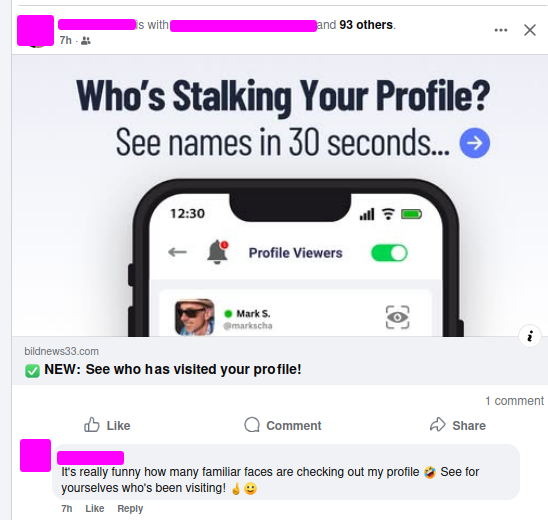

---

## Evidence Collected

The following evidence was collected at the initial stage:

- Screenshot of the Facebook post  
- Full Facebook redirect link (copied safely using “Copy Link”)  
- Visible domain name (`bildnews33.com`)  
- Observation of different visibility between accounts  

The link was not clicked directly from the main browser. Instead, it was analysed in a controlled environment.

---

## Link Extraction & Decoding

The copied link used a Facebook redirect wrapper (`l.facebook.com`). After decoding the `u=` parameter, the real destination was identified as:

`https://bildnews33.com/p2-en/?utm_campaign=1220931354&tsid=8&fqty=1500&date_val=25_mar&pnum=090e6fff671c8fc7&com_id=28`

The URL contained multiple tracking parameters such as:
- `utm_campaign`
- `tsid`
- `pnum`
- `com_id`

This suggested the link was part of a tracked campaign rather than a simple static page.

---

## Passive Recon (Domain Analysis)

Initial checks were carried out using `whois`, `dig`, and `curl`.

Findings:
- The domain is relatively new  
- Privacy protection is enabled  
- Cloudflare is being used as a proxy  

Direct access to the root domain did not immediately show malicious content, suggesting possible conditional behaviour.

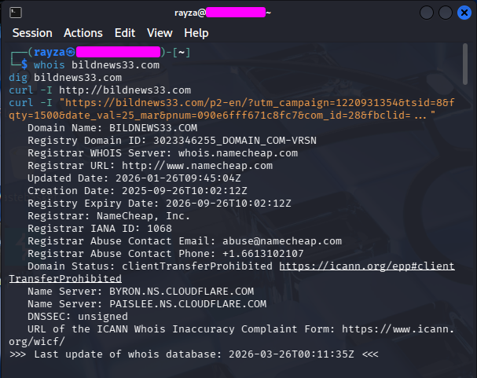

---

## Behaviour Analysis (Redirect Chain and Landing Page)

The link was opened in Burp Suite’s browser to observe behaviour safely.

### Redirect Chain

The following sequence was observed:

1. `l.facebook.com`  
2. `bildnews33.com`  
3. `brucialseffset.com`  
4. `bildnachricht.com`  

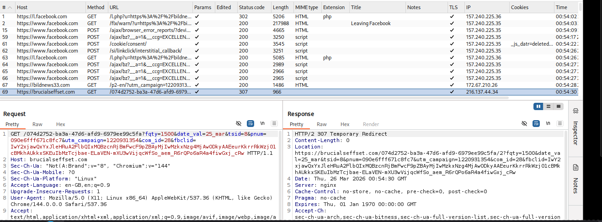  
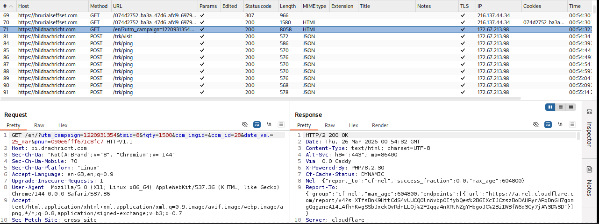

---

### Landing Page

The final page displayed:

> “(33) people have viewed your profile in the last 2 days!”

With a button labelled:

> “Show List”

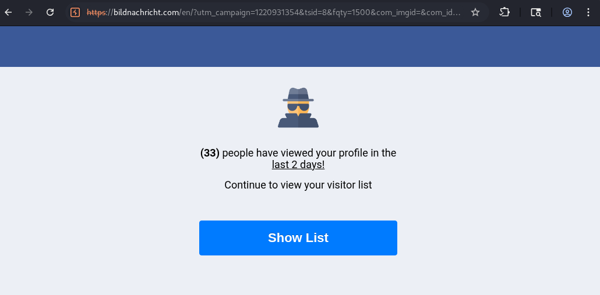

Tracking requests such as `/trk/ping` were observed, indicating that user activity is being monitored.

---

## Interaction Analysis (Post-Click Behaviour)

After clicking “Show List”, the page remained on the same domain:

- `bildnachricht.com`

A login prompt was displayed:

> “Enter login to view the full list.”

The page included:
- Mobile number or email field  
- Continue button  

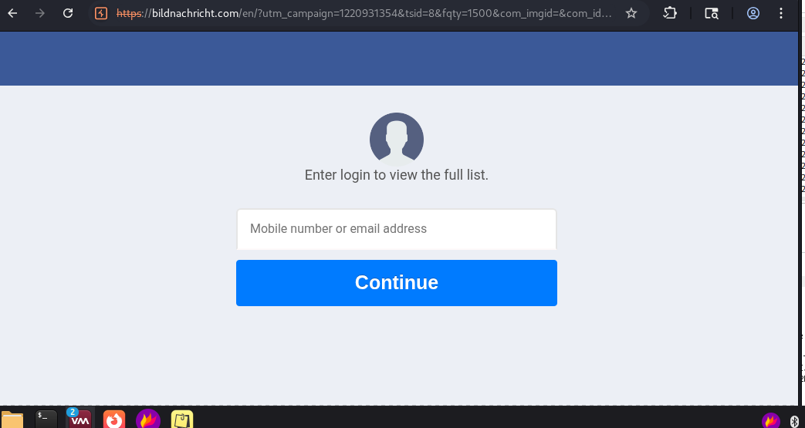

---

### Network Activity Observed

Two key POST requests were captured:

- `/trk/click` → tracks user interaction  
- `/api/init-login` → initialises login session  

This indicates that the site is preparing to collect user credentials.

---

## Domain & Infrastructure Analysis

Three domains were involved in the attack chain:

- `bildnews33.com` → entry point  
- `brucialseffset.com` → redirect layer  
- `bildnachricht.com` → credential harvesting page  

Observations:

- All domains are recently registered  
- Privacy protection is used  
- Different providers are used:
  - Cloudflare  
  - AWS CloudFront  

This suggests a layered setup designed to:
- obscure the attack chain  
- track users  
- deliver the final payload  

---

## Overall Assessment

This is a multi-stage credential harvesting campaign.

The attack flow is:

1. Social engineering via Facebook post  
2. Redirect chain across multiple domains  
3. Engagement page to build curiosity  
4. Fake login page to collect credentials  

---

## Indicators of Compromise (IOCs)

### Domains
- bildnews33.com  
- brucialseffset.com  
- bildnachricht.com  

### Endpoints
- /trk/ping  
- /trk/click  
- /api/init-login  

---

## Recommendations

- Avoid clicking suspicious links  
- Do not enter credentials on external sites  
- Enable two-factor authentication (2FA)  
- Review account activity  
- Remove unknown apps  

---

## Ethical Considerations

- No real credentials were entered  
- Analysis was conducted in a controlled environment  
- No actions were taken that could impact others  

---

## Responsible Disclosure

This phishing campaign was reported to the relevant platforms and service providers.

### Reports Submitted

- **Facebook**  
  - The original post was reported via Facebook’s reporting system  
  - Result: Post removed for violating Community Standards  

- **Cloudflare**  
  - Domains reported as phishing infrastructure  
  - Result: Phishing warning page deployed on `bildnachricht.com`  

- **Amazon Web Services (AWS)**  
  - Report submitted regarding hosting infrastructure used in the redirect chain  

- **Namecheap (Registrar)**  
  - Report submitted for `bildnachricht.com`  

- **Key-Systems (Registrar)**  
  - Report submitted for `brucialseffset.com`
  - Result: - Confirmed they are the registrar only (no control over hosting/content)  
  - Complaint forwarded to reseller (Commerce Media Tech sp. z o.o.)

### Outcome

- The original Facebook post was removed
- At least one domain (`bildnachricht.com`) is now actively flagged as phishing
- Hosting and domain providers acknowledged the reports and are investigating

### Notes

- No sensitive data was submitted during testing  
- All analysis was conducted in a controlled lab environment (VM)  
- No interaction was made with real user accounts or credentials  

---

## Post-Takedown Analysis & Verification

After reporting the campaign, I monitored the infrastructure to see what happened next.

---

### Initial Response

- The original Facebook post was removed  
- `bildnachricht.com` was flagged by Cloudflare as phishing  

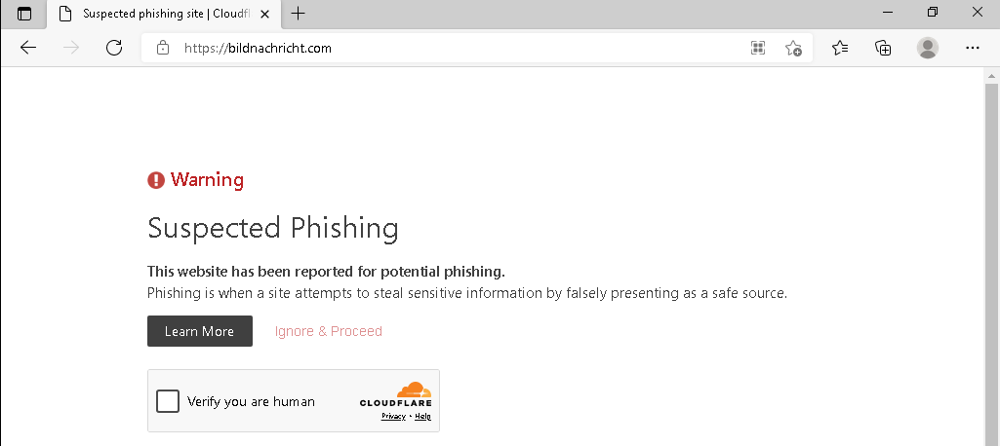

---

### Attacker Adaptation

Shortly after, the attackers rotated infrastructure:

- `bildnews33.com` remained in use as the entry point for a period  
- `brucialseffset.com` continued to appear in the chain, although it returned 404 when accessed directly  
- A new landing domain, `profilestalkers.com`, was introduced  

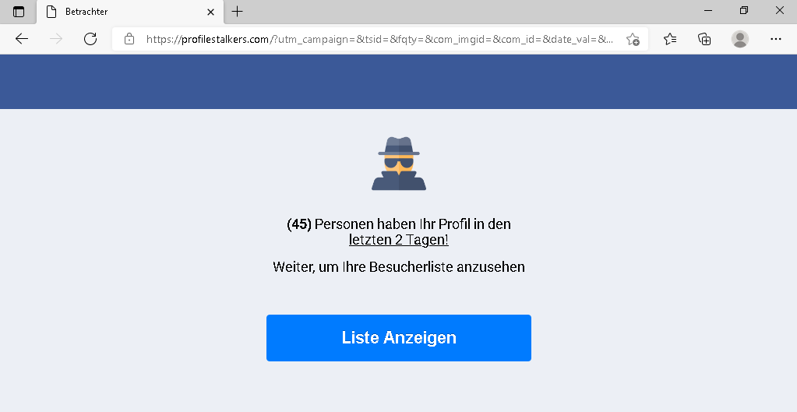

This showed that the campaign was still being actively maintained at that stage.

---

### Domain Status Changes after 24hrs

Follow-up checks were carried out approximately 24 hours after the initial investigation.

The following screenshots show the state of the infrastructure after reporting:

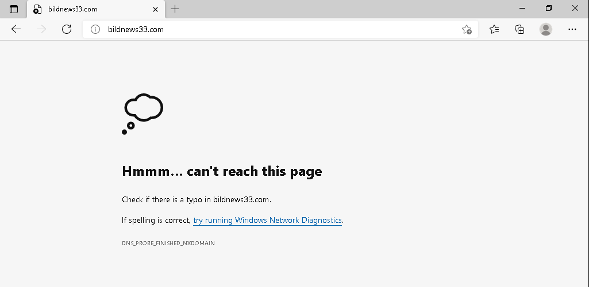  
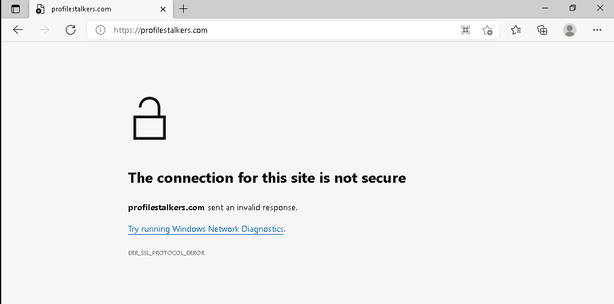  
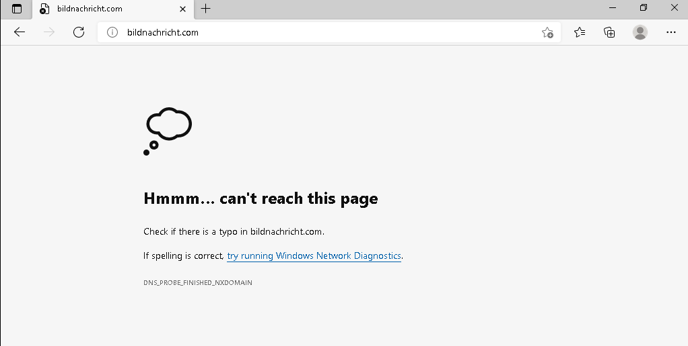

---

### Verification (Terminal Output)

The following checks were performed from a Kali Linux environment:

    whois bildnews33.com
    dig bildnews33.com
    curl -I http://bildnews33.com

    # Result:
    # - Domain status: clientHold
    # - DNS: NXDOMAIN
    # - HTTP: Could not resolve host

    whois bildnachricht.com
    dig bildnachricht.com
    curl -I http://bildnachricht.com

    # Result:
    # - Domain status: clientHold
    # - DNS: NXDOMAIN
    # - HTTP: Could not resolve host

    whois profilestalkers.com
    dig profilestalkers.com
    curl -I http://profilestalkers.com

    # Result:
    # - DNS resolves to 31.192.108.218
    # - HTTP returns 308 redirect to HTTPS
    # - HTTPS connection fails (SSL error)

---

### What Happened After Reporting

From the checks above, two of the domains, `bildnews33.com` and `bildnachricht.com`, have been fully taken down.

Both now show `clientHold` in WHOIS, return `NXDOMAIN` in DNS, and no longer respond to HTTP requests. In practical terms, they have been removed from use.

`profilestalkers.com` is different. The domain still exists and still responds, but it no longer functions properly as a phishing page because the HTTPS connection fails. So although it has not disappeared entirely, it is effectively broken.

---

### Outcome

At this point:

- The original Facebook post has been removed  
- The main domains in the redirect chain have been taken down  
- The replacement landing page is no longer working properly  

The full attack chain no longer works from start to finish.

---

### Lessons Learned

One of the biggest things this investigation taught me was how important it is to collect evidence as early as possible when dealing with live phishing pages, because things can change very quickly once reports start being actioned.

It was also useful to see how fast the attackers switched to a replacement landing page when the original redirect chain started failing. That reminded me that follow-up checks are just as important as the initial investigation, because the first takedown is not always the true end of the campaign.

From a personal workflow point of view, this helped me get more comfortable using Burp Suite inside an isolated VM to safely watch redirects and supporting requests without entering real credentials.

If I were doing this again, I would spend more time digging into the POST request and response flow after capturing it, so I could better understand exactly how the fake login page was handling submitted data and what the attacker backend may have been doing with it.

---

### Final Thoughts

For me, this was a really useful real-world example of how quickly phishing infrastructure can be disrupted when clear evidence is collected and reported to the right providers.

What stood out most was seeing that even a relatively small, careful investigation could contribute to breaking an active scam chain from start to finish.

It reinforced the value of safe hands-on investigation, good documentation, and responsible disclosure as practical ways to learn while still having a real positive impact.
